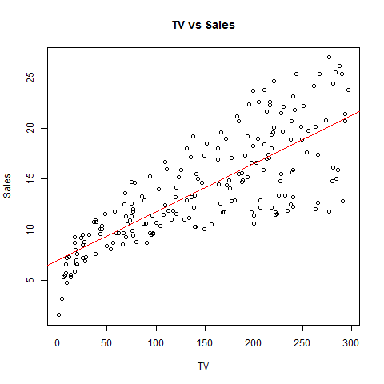

```{r setup, include=FALSE}


load("~/pandoc-test/stat159/stat159-fall2016-hw02/data/regression.RData")
library(xtable)

```


# Abstract

  In this report, we will investigate the findings of comparing the relationship of TV vs. Sales.  We will mostly look at the data through R, specifically looking at the scatterplot of TV and Sales to see if there is a trend between the 2, then try to fit a regression line. We will calculate the data of the regression line through R and see what we can conclude from the simple linear model.


# Introduction

  We examine a simple linear regression model.  We will look at the data from the book "An Introduction to Statistical Learning" by James et al.  We will specifically look at the plot of TV vs. Sales and take a look at the regression line.  We are particularly interested in the data for the regression residuals, including intercept and slope, more commonly known as the coefficients of the regression line, as we look at the strength of the line.  In addition, we will also examine the $R^2$ statistic as a measure of the linear relationship between TV and Sales, as well as the F-statistic, which is part of the ANOVA hypothesis test.


This is a result of the least squares regression fit of Sales on TV from the Advertising data set. 




# Data

The data set, Advertising.csv contains data for `r colnames(ad)[2:length(ad)]`. 

This summary tables details out the estimated coefficients of the linear least squares line. Complete with a standard error of the estimates as well as the t- and p- values. From this, we can conclude that $\hat \beta_0$ and $\hat \beta_1$ are not equal to 0. 


\begin{table}[ht]
\centering
\begin{tabular}{rrrrr}
  \hline
 & Coefficient & Std. Error & t-statistic & p-value \\ 
  \hline
Intercept & 7.03 & 0.46 & 15.36 & 0.00 \\ 
  TV & 0.05 & 0.00 & 17.67 & 0.00 \\ 
   \hline
\end{tabular}
\end{table}


This marks the code of the actual summary output in R.  These are the details of the regression line.


The content in this table displays 3 things.  First, the residual standard error, or $RSE$ which is the estimated standard error of errors, $\epsilon$, describing the so-called "lack of fit" of the model.  The second term, $R^2$ explains how much of the variability was due to the regression.  This is on a scale of 0 to 1.  The last term is the F-statistic, is the test statistic of running an ANOVA hypothesis test to find if the means of the two categories are the same or not.  In this case, our F-statistic corresponds to a p-value of <<0.000001, so therefore you can safely reject the null hypothesis, $H_0$.

\begin{table}[ht]
\centering
\begin{tabular}{rll}
  \hline
 & Quantity & Values \\ 
  \hline
A & Residual standard error & 3.259 \\ 
  B & $R^2$ & 0.612 \\ 
  C & $F$-statistic & 312.145 \\ 
   \hline
\end{tabular}
\end{table}


# Methodology

We will first look at our data set, advertising.csv to look at the varibales used.  `r colnames(ad)[2:5]` are the variables we get by looking at the column names of our data sheet.  We then wish to look at the relationship between TV and Sales.  To do so, we first generate a scatterplot of the 2 against each other.  Next, we create the regression line using the lm() function of the data. To get these estimates of the coefficients, we look at the outputs of the lm() function to see the statistics of the regression line (as shown below).  


```{r, echo=FALSE}

summary


values <- c(summary$sigma, summary$r.squared, as.vector(summary$fstatistic[1]))
rownames<- c('Residual standard error','R^2', 'Fstatistic')
table <- as.table(matrix(c(rownames,round(values,3)), nrow=3,ncol=2, dimnames=list(NULL, c('Quantity','Values'))))

```


# Results

By looking at the data table of the coefficients of the regression line, we see that estimated coefficient, $\hat \beta_0$ is an estimate with a standard error of .46.  From the t-test, we find that the both t-statistics have p-values of less than <<0.00001. Therefore, we can conclude that both $\hat \beta_0$ and $\hat \beta_0$ are not equal to 0. This means that there is an actual relationship between the 2 categories.
Looking at the second table, we find the value of the standard error of the residuals is 3.259. The $R^2$ statistic, is known as the 'adjusted R-squared' value, represents the percentage of the linear regression line is actually due to the 2 predictors. The $F$-statistic, we find is 312.145, is generated from the ANOVA test to determine whether the means of the 2 categories are the same.  From the more interesting p-value, $2.2 \times 10^-16$ concludes that the means of TV and Sales are differnet.


# Conclusions

From the data, we can conclude that there is a linear relationship between the 2 data categories, TV and Sales from the data set given.  This was shown the the regression line and the values of the estimated coefficients.  